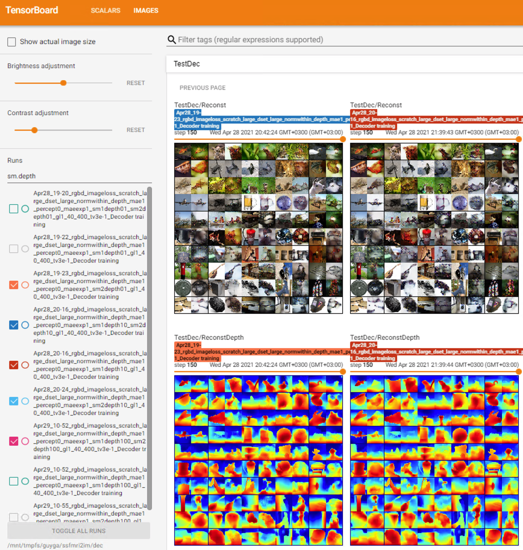

# Self-Supervised RGBD Reconstruction from Brain Activity 🧠

***Official PyTorch implementation & pretrained models for:***
> **More than Meets The Eye: Self-Supervised Depth Reconstruction from Brain Activity** \
> *Guy Gaziv, Michal Irani*

<a href="https://arxiv.org/abs/2106.05113" target="_blank"></a>

> **Self-Supervised Natural Image Reconstruction and Rich Semantic Classification from Brain Activity** \
> *Guy Gaziv\*, Roman Beliy\*, Niv Granot\*, Assaf Hoogi, Francesca Strappini, Tal Golan, Michal Irani*  

<a href="https://doi.org/10.1101/2020.09.06.284794" target="_blank"></a>
<a href="http://www.wisdom.weizmann.ac.il/~vision/SSReconstnClass/" target="_blank"></a>
<a href="https://video.tau.ac.il/events/index.php?option=com_k2&view=item&id=10112:fmri&Itemid=550" target="_blank"></a>

<div align="center">
  
</div>

##
### Setup
### Code & environment
Clone this repo and create a designated conda environment using the `env.yml` file:
```
cd SelfSuperReconst
conda env create --name <envname> --file=env.yml
conda activate <envname>
pip install -e .
```

###  Data
This code requires all necessary data to be placed/linked under `data` folder in the structure below. \
*For completeness and ease of demo*, we release the data for download **[HERE](https://github.com/WeizmannVision/SelfSuperReconst/releases).** \
**The following convenience script sets up all data automatically.**
```
cd SelfSuperReconst
./setup_data.sh
```
```
/data
┣ 📂 imagenet
┃	┣ 📂 val
┃ 	┃	┗ (ImageNet validation images by original class folders)

┣ 📂 imagenet_depth
┃	┣ 📂 val_depth_on_orig_small_png_uint8
┃	┃	┗ (depth component of ImageNet validation images using MiDaS small model)
┃	┣ 📂 val_depth_on_orig_large_png_uint8
┃	┃	┗ (depth component of ImageNet validation images using MiDaS large model)

┣ 📂 imagenet_rgbd
┃	┗	(pretrained depth-only & RGBD vgg16/19 model checkpoints optimized for ImageNet classification challenge; These are used as Encoder backbone net or as a reconstruction metric)

┣ 📜 images_112.npz (fMRI on ImageNet stimuli at resolution 112x112)
┣ 📜 rgbd_112_from_224_large_png_uint8.npz (saved RGBD data at resolution 112, depth computed on 224 stimuli using MiDaS large model and saved as PNG uint8)
┣ 📜 sbj_<X>.npz (fMRI data)
┗ 📜 model-<X>.pt (MiDaS depth estimation models)
```

##
### Training
The `scripts` folder provides most of the basic utility and experiments. In a nutshell, the training is comprised of two phases: (i) Encoder training implemented in `train_encoder.py`, followed by (ii) Decoder training, implemented in `train_decoder.py`.
Each of those scripts need be run with the relevant flags which are listed in config files. General flags for both Encoder & Decoder training are listed in `config.py`, and Encoder/Decoder-training specific flags in `config_enc.py` or `config_dec.py`, respectively.
Make sure to set the `tensorboard_log_dir` and `gpu` variables within the scripts.
Note that decoder training assumes existence of a (pretrained) encoder checkpoint.
We further provide general functionality tests to be used with `pytest`.

#### Example 1 (RGB-only):
Train RGB-only Encoder (supervised-only):
```
python $(scripts/train_enc_rgb.sh)
```
Then train RGB-only Decoder (supervised + self-supervised):
```
python $(scripts/train_dec_rgb.sh)
```
The results (reconstructions of train and test images) will appear under `results`. Detailed tensorboard logs will output under `<tensorboard_log_dir>` (to be set within the scripts).

#### Example 2 (Depth-only):

`python $(scripts/train_enc_depth.sh)` followed by `python $(scripts/train_dec_depth.sh)`

#### Example 3 (RGBD):
`python $(scripts/train_enc_rgbd.sh)` followed by `python $(scripts/train_dec_rgbd.sh)`

<div align="left">
  
</div>

##
### Evaluation
The `eval.ipynb` notebook provides functionality for evaluating reconstruction quality via n-way identification experiments (two types: % correct or rank identification, see paper).
The DataFrame with evaluation results is saved under `eval_results` folder as a `.pkl` file.
The `eval_plot.ipynb` loads these data and implements some basic visualization and printing of results.

##
### Acknowledgments
- This code borrows from [MiDaS Monocular Depth Estimation](https://github.com/isl-org/MiDaS/releases/tag/v1), and [Perceptual Similarity Metric](https://github.com/richzhang/PerceptualSimilarity).
- The original datasets behind the released data derivatives are ([fMRI on ImageNet](https://openneuro.org/datasets/ds001246/versions/1.0.1), and [ILSVRC](https://image-net.org/challenges/LSVRC/index.php)).
##
### Citation
If you find this repository useful, please consider giving a star ⭐️ and citation:
```
@article{Gaziv2021MoreActivity,
	title = {{More than Meets The Eye: Self-Supervised Depth Reconstruction from Brain Activity}},
	author = {Gaziv, Guy and Irani, Michal},
	journal={arXiv preprint arXiv:2106.05113},
	year = {2021}
}

@article{Gaziv2020,
	title = {{Self-Supervised Natural Image Reconstruction and Rich Semantic Classification from Brain Activity}},
	author = {Gaziv, Guy and Beliy, Roman and Granot, Niv and Hoogi, Assaf and Strappini, Francesca and Golan, Tal and Irani, Michal},
	journal = {bioRxiv},
	year = {2020}
}
```
